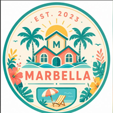

# منتجعات ماربيلا — نظام الحجز الإلكتروني

نظام حجز بسيط بالعربية لعدد من الاستراحات. صفحة واحدة (رابط واحد) تعمل على الجوال والحاسب.

## المميزات
- صور لكل استراحة (معرض صور)
- موقع كل استراحة على خرائط جوجل
- تقويم يعرض التواريخ المتاحة والمحجوزة
- اختيار الاستراحة والتاريخ وإرسال الطلب مباشرة عبر واتساب
- روابط انستغرام وتيك توك وواتساب
- تصميم عربي RTL متجاوب

## بنية المشروع
```
index.html        ← الصفحة الرئيسية (افتحها بالمتصفح)
css/style.css     ← التصميم
js/data.js        ← البيانات والإعدادات (عدّل من هنا)
js/app.js         ← منطق التقويم والواتساب والخرائط
assets/images/    ← صور الاستراحات
```

## التشغيل المحلي
افتح ملف `index.html` مباشرة في المتصفح، أو شغّل خادماً بسيطاً:
```powershell
python -m http.server 8000
```
ثم افتح: http://localhost:8000

## التعديل السريع (بدون برمجة)
افتح `js/data.js` وعدّل:
- `whatsapp` و `phoneDisplay`: رقم الواتساب
- `instagram` و `tiktok`: روابط التواصل
- `brandName`: اسم العلامة التجارية
- مصفوفة `UNITS`: أسماء الاستراحات، الأسعار، الوصف، المميزات، الإحداثيات (lat/lng)

## تحديث التواريخ المحجوزة
عند تأكيد حجز عبر واتساب، افتح `js/data.js` وأضف التاريخ داخل قائمة `booked` للاستراحة المعنية:
```js
booked: ["2026-07-05", "2026-07-12"]
```
ثم ارفع التحديث للموقع (انظر النشر).

> ملاحظة: هذا نظام ثابت بدون قاعدة بيانات. التواريخ المحجوزة تُحدّث يدوياً.
> إذا أردت حجزاً تلقائياً ومشاركاً بين كل العملاء، يمكن ربطه لاحقاً بـ Firebase أو Google Sheets.

## النشر على رابط واحد مجاني (Netlify)
1. ادخل https://app.netlify.com وسجّل مجاناً
2. اضغط "Add new site" → "Deploy manually"
3. اسحب مجلد المشروع كاملاً إلى صندوق الرفع
4. ستحصل على رابط فوري (مثال: https://marbella-resorts.netlify.app)
5. لتغيير الرابط: Site settings → Change site name

## النشر عبر Vercel (بديل)
1. ادخل https://vercel.com وسجّل
2. "Add New Project" → ارفع المشروع من GitHub أو اسحب المجلد
3. اضغط Deploy

## إضافة شعار (لوغو) حقيقي
ضع ملف الشعار في `assets/images/logo.png` ثم عدّل في `index.html` العنصر ذو الكلاس `logo`
ليصبح صورة:
```html

```

## استبدال الصور
ضع صورك في `assets/images/` بنفس الأسماء، أو عدّل المسارات في `js/data.js` ضمن `images`.

## روابط التواصل الحالية
- واتساب: +971 56 622 2566
- انستغرام: https://www.instagram.com/resortmarbella
- تيك توك: يُضاف في `js/data.js` ضمن `tiktok`
